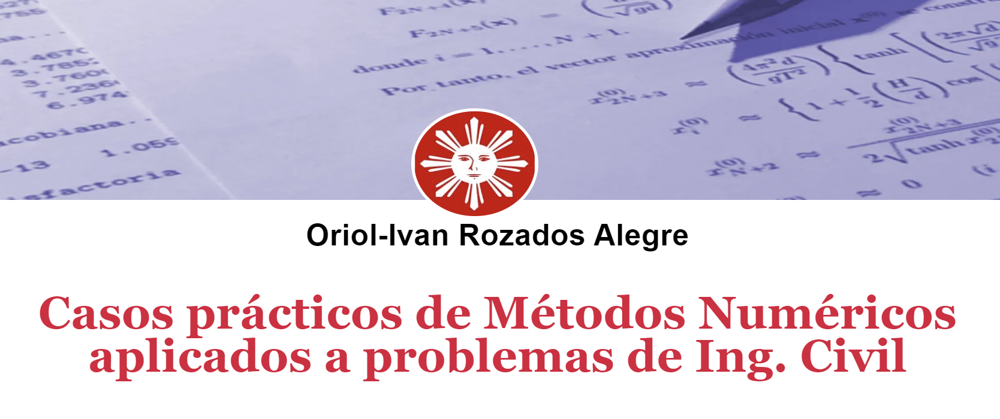

 
 <h1>
   ${\LARGE\textrm{\color{royalblue}Casos prácticos de Métodos Numéricos}}$
   ${\LARGE\textrm{\color{royalblue}aplicados a problemas de Ing. Civil}}$
   ${\color[RGB]{0,0,255}\:\Tiny By\:ORA\:-\:(oriol.rozados@gmail.com)}$
 </h1> 

 
  

